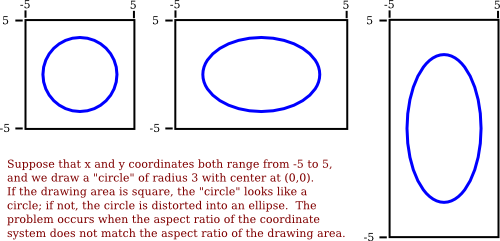

# 第2.1节

## 像素，坐标和颜色

要创建二维图像，图像中的每个点都会分配一种颜色。2D中的点可以通过一对数值坐标来识别。颜色也可以用数字指定。但是，将数字分配给点或颜色有点武断。因此，我们需要花一些时间来研究将数字与点相关联的坐标系，以及将数字与颜色相关联的颜色模型。


###  2.1.1像素坐标

数字图像由像素的行和列组成。可以通过说出哪一列和哪一行包含它来指定这种图像中的像素。就坐标而言，可以通过给出列号和行号的一对整数来标识像素。例如，具有坐标（3,5）的像素将位于列号3和行号5中。传统上，列从左到右编号，从零开始。大多数图形系统，包括我们将在本章学习的图形系统，从上到下编号，从零开始。一些（包括OpenGL）从下到上对行进行编号。


特别注意，由一对坐标（x，y）标识的像素取决于坐标系的选择。在了解您所谈论的内容之前，您始终需要知道正在使用的坐标系。

行号和列号标识像素，而不是点。像素包含许多点; 在数学上，它包含无数个点。计算机图形学的目标并不是真正的彩色像素 - 它是创建和操纵图像。在某种理想意义上，应该通过为每个点指定颜色来定义图像，而不仅仅是为每个像素。像素是近似值。如果我们想象我们想要显示的是真实的理想图像，那么我们通过着色像素显示的任何图像都是近似值。这有很多含义。

例如，假设我们想要绘制一个线段。数学线没有厚度，看不见。所以我们真的想画一条粗线段，有一些指定的宽度。假设该线应该是一个像素宽。问题在于，除非线条是水平的或垂直的，否则我们实际上无法通过着色像素来绘制线条。对角线几何线将仅部分覆盖一些像素。不可能将像素的一部分变为黑色而将其一部分变为白色。当您尝试仅绘制具有黑色和白色像素的线时，结果是锯齿状的阶梯效果。此效果是称为“别名”的示例。也可以在屏幕上绘制的字符轮廓以及任何两个不同颜色区域之间的对角线或曲线边界中看到混叠。

抗锯齿 是用于减轻别名影响的技术术语。这个想法是当像素仅部分被形状覆盖时，像素的颜色应该是形状颜色和背景颜色的混合。在白色背景上绘制黑线时，部分覆盖的像素的颜色将为灰色，灰色阴影取决于线所覆盖的像素的分数。（实际上，精确计算每个像素的这个区域将会非常困难，因此使用了一些近似方法。）例如，这里是一条几何线，如左图所示，以及通过着色像素制作的两条近似线。线条被大幅放大，以便您可以看到各个像素。右边的线是使用抗锯齿绘制的，


请注意，抗锯齿不能提供完美的图像，但它可以减少由锯齿引起的“锯齿”（至少在正常比例下观看时）。

将实数坐标映射到像素还涉及其他问题。例如，像素中的哪个点应该对应于整数值坐标，例如（3,5）？像素的中心？像素的一角？通常，我们将数字视为指像素的左上角。另一种思考方式是说整数坐标是指像素之间的线，而不是像素本身。但是，在绘制几何形状时，仍然无法准确确定哪些像素会受到影响。例如，下面是使用HTML画布图形绘制的两条线，显示得非常放大。这些线被指定为黑色，具有一个像素的线宽：


顶线是从点（100,100）到点（120,100）绘制的。在画布图形中，整数坐标对应于像素之间的线，但是当绘制一条像素线时，它在无限薄几何线的任一侧延伸半个像素。因此，对于顶行，绘制的线在一行像素中占一半，在另一行中占一半。渲染使用抗锯齿的图形系统通过将两行像素着色为灰色的线。底线是从点（100.5,100.5）到（120.5,120.5）。在这种情况下，该线恰好沿着一行像素，其变为黑色。底线末端的灰色像素与线仅在其端点处延伸到像素中途的事实有关。其他图形系统可能以不同方式呈现相同的线条

由于像素不是以往的事实，所有这一切都变得复杂了。今天的像素更小！显示装置的分辨率可以根据显示器上每英寸的像素数量来衡量，数量称为PPI（每英寸像素数）或有时称为DPI（每英寸点数）。早期的屏幕倾向于具有接近72 PPI的分辨率。在该分辨率下，并且在典型的观看距离处，各个像素清晰可见。有一段时间，似乎大多数显示器每英寸大约有100个像素，但今天的高分辨率显示器每英寸可以有200,300或甚至400个像素。在最高分辨率下，无法再区分各个像素。

如果我们使用基于像素的坐标系，像素具有如此大小范围的事实是一个问题。假设每英寸有100个像素而创建的图像在400 PPI显示屏上看起来很小。一个像素宽的线在100 PPI下看起来很好，但在400 PPI时，一个像素宽的线可能太薄了。

实际上，在许多图形系统中，“像素”实际上并不是指物理像素的大小。相反，它只是另一种度量单位，由系统设置为适当的。（在桌面系统上，像素通常大约是百分之一英寸。在智能手机上，通常从更近的距离观看，该值可能接近1/160英寸。此外，例如，当用户将放大率应用于网页时，像素作为度量单位可能会发生变化。）

像素会导致尚未完全解决的问题。幸运的是，它们对矢量图形来说不是一个问题，这主要是我们将在本书中使用的。对于矢量图形，像素仅在光栅化期间成为问题，  光栅化是将矢量图像转换为像素以供显示的步骤。可以使用任何方便的坐标系创建矢量图像本身。它代表了一种理想化的，与分辨率无关的图像。光栅化图像是该理想图像的近似值，但是如何进行近似可以留给显示硬件。

---

### 2.1.2实数坐标系

在进行2D图形处理时，会给出一个矩形，您可以在其中绘制一些图形基元。使用矩形上的某些坐标系指定基元。应该可以选择适合应用的坐标系。例如，如果矩形表示15英尺乘12英尺的房间的平面图，那么您可能想要使用一个坐标系，其中测量单位是一英尺，坐标范围从0到15，水平方向和垂直方向为0到12。在这种情况下，测量单位是英尺而不是像素，并且一英尺可以对应于图像中的许多像素。一般来说，像素的坐标是实数而不是整数。事实上，最好忘记像素，只考虑图像中的点。一个点将具有由实数给出的一对坐标。

要指定矩形的坐标系，只需指定矩形左右边缘的水平坐标和顶部和底部的垂直坐标。我们将这些值称为left， right，top和bottom。通常，它们被认为是xmin，xmax，ymin和ymax，但没有理由假设，例如，top 小于bottom。我们可能需要一个坐标系，其中垂直坐标从下到上而不是从上到下增加。在那种情况下，顶部将对应于最大y值而不是最小值。

为了允许程序员指定他们想要使用的坐标系，最好有一个子程序，如

```
setCoordinateSystem（左，右，底，顶）
```
然后，图形系统负责将坐标从指定的坐标系自动  转换为像素坐标。这样的子程序可能不可用，因此查看转换是如何手动完成是有用的。让我们考虑一般情况。给定一个坐标系中一个点的坐标，我们想要找到第二个坐标系中同一点的坐标。（请记住，坐标系只是一种为点指定数字的方法。它是真实的点！）假设第一个坐标系的水平和垂直限制是oldLeft，oldRight，oldTop和oldBottom，并且是newLeft，newRight，newTop和newBottom为第二个。假设一个点在第一个坐标系中有坐标（oldX，oldY）。我们想要找到第二个坐标系中点的坐标（newX，newY）


然后给出newX和newY的公式

```
newX = newLeft + 
          （（oldX  -  oldLeft）/（oldRight  -  oldLeft））*（newRight  -  newLeft））
newY = newTop + 
          （（oldY  -  oldTop）/（oldBottom  -  oldTop））*（newBotom  -  newTop）
``

这里的逻辑是oldX位于从oldLeft到 oldRight的距离的某一部分。该分数由。给出

```
（（oldX  -  oldLeft）/（oldRight  -  oldLeft））
```

newX的公式只是说newX应该位于从newLeft到newRight的距离的相同部分。当oldX等于oldLeft或oldRight时，以及当oldY等于oldBottom或oldTop时， 您还可以通过测试它们的工作来检查公式。

作为一个例子，假设我们想要将一些实数坐标系变换为左，右，顶部和底部限制为像素坐标，范围从左边的0到右边的800和底部的顶部600的0 。在这种情况下，newLeft和newTop为零，公式变得简单

```
newX =（（oldX  -  left）/（right  -  left））* 800
newY =（（oldY  -  top）/（bottom  -  top））* 600
```

当然，这会将newX和newY作为实数，如果我们需要像素的整数坐标，则必须将它们舍入或截断为整数值。从像素坐标到实数坐标的反向变换也是有用的。例如，如果图像显示在计算机屏幕上，并且您想要对图像上的鼠标点击做出反应，您可能会根据整数像素坐标获得鼠标坐标，但您需要将这些像素坐标转换为您的自己选择的坐标系。

但实际上，您通常不必自己进行转换，因为大多数图形API都提供了一些更高级别的方法来指定转换。我们将在2.3节中详细讨论这个问题。

---

### 2.1.3纵横比

矩形的纵横比是其宽度与高度的比率。例如，纵横比为2：1意味着矩形的宽度是其高度的两倍，纵横比为4：3意味着宽度是高度的4/3倍。尽管纵横比通常以宽度：高度的形式写出，但我将使用该术语来指代分数宽度/高度。正方形的纵横比等于1.纵横比为5/4且高度为600的矩形的宽度等于600 *（5/4）或750。

坐标系也具有纵横比。如果坐标系的水平和垂直限制是左，右，底和顶，如上所述，则纵横比是绝对值

```
（右 - 左）/（上 - 下）
```

如果坐标系用于具有相同纵横比的矩形，则在该矩形中查看时，水平方向上的一个单位将具有与垂直方向上的单位相同的表观长度。如果纵横比不匹配，则会出现一些失真。例如，由等式x 2  + y 2  = 9 定义的形状应该是圆形，但只有在（x，y）坐标系的纵横比与绘图区域的纵横比匹配时才会成立。



在垂直和水平方向上使用不同长度单位并不总是坏事。但是，假设您要使用具有左，右， 底部和顶部限制的坐标，并且您确实希望保留纵横比。在这种情况下，根据显示矩形的形状，您可能需要调整 左侧和右侧或底部和顶部的值以使宽高比匹配


